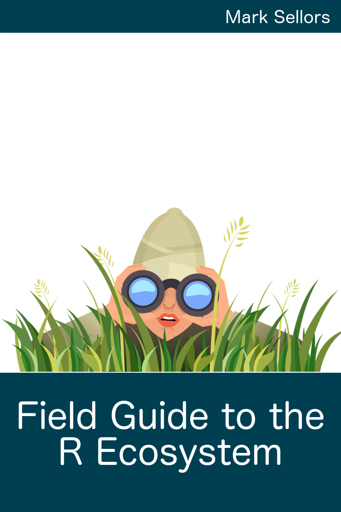

--- 
title: "Field Guide to the R Ecosystem"
author: "Mark Sellors"
date: "`r Sys.Date()`"
site: bookdown::bookdown_site
output: bookdown::gitbook
documentclass: book
biblio-style: apalike
link-citations: yes
github-repo: sellorm/field-guide-to-the-r-ecosystem
description: "This guide aims to introduce the reader to the main elements of the R ecosystem."
url: "http://fg2re.sellorm.com"
cover-image: "cover.png""
---

# {-}

This work is licensed under a [Creative Commons Attribution 4.0 International License](https://creativecommons.org/licenses/by/4.0/).
